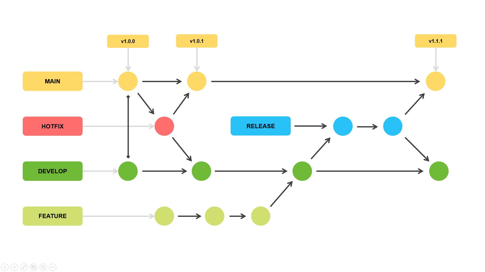
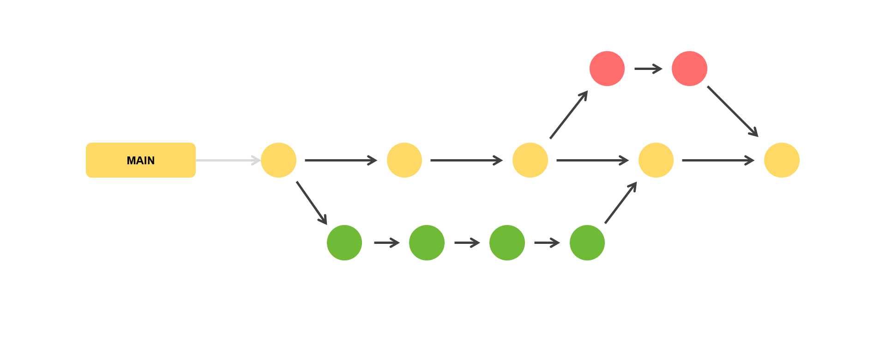

# Git Patterns

### Padrões para projetos GIT, como modelos de commit e fluxo de branches.

*O repositório visa introduzir os padrões de forma sucinta. Para abordagens completas se deve procurar as documentações oficiais.* 

## Conventional Commits

O desenvolvimento utilizando Git é comum para qualquer desenvolvedor, como também a falta de padrões para commits. 

Para manter um padrão conciso o Conventional Commits sugere o modelo:

``` bash
<type>[optional scope]: <description>

[optional body]

[optional footer(s)]
```

Os significados de cada elemento são:

`type`: Caracteriza a natureza da mudança. Tem como valores padrões:
- `feat`
- `fix`
- `docs`
- `style`
- `refactor`
- `perf`
- `test`
- `build`
- `ci`
- `chore`
- `revert`

`scope`: Contextualiza o commit, podendo informar branches, arquivos ou funções.

`description`: Descrição curta do commit. É recomendado utilizar o imperativo ao invés do pretérito. O commit deve descrever **o que fará caso aplicado**, dessa forma a expressão - *Caso aplicado irá criar dashboard de casos* - descreve melhor que - *Caso aplicado irá criação de dashboard de casos*.

`body`: Descrição longa do commit. Contextualiza de forma detalhada o `description`.

`footer`: Rodapé do commit, normalmente informa uma BREAKING CHANGE em concordância com o [SemVer](https://semver.org/). O objetivo é alertar e descrever a incompatibilidade com a versão anterior. Caso não haja uma BREAKING CHANGE, ainda se pode informar usando outra convenção, como [git trailer](https://git-scm.com/docs/git-interpret-trailers).

Exemplos:

- Commit simples
``` bash
docs: correct spelling of CHANGELOG
```
- Commit com `scope`
``` bash
feat(lang): add Polish language
```
- Commit com `body`
``` bash
fix: prevent racing of requests

Introduce a request id and a reference to latest request.
Dismiss incoming responses other than from latest request.
```
- Commit com `footer` BREAKING CHANGE
``` bash
feat: allow provided config object to extend other configs

BREAKING CHANGE: `extends` key in config file is now used for extending other config files
```
- Commit com `footer`
``` bash
refactor: change createUser() logs

Reviewed-by: Admin
Refs: #123
```

## Commitlint & Commitizen

Para facilitar a adoção do Conventional Commits, se sugere utilizar o [Commitlint](https://commitlint.js.org/#/) ou [Commitizen](https://github.com/commitizen/cz-cli). Eles fornecem uma CLI que auxilia a aderência da convenção.

## Git Flow

O Git Flow é um modelo de ramificação que proporciona maior controle sobre o código fonte.

O modelo sugere o seguinte fluxo:



No fluxo é descrito as seguintes branches:

`main`: Possui o código de produção e permanece viva durante todo o fluxo. Não pode ser modificada diretamente.

`hotfix`: Tem como objetivo ajustar erros em produção. Se origina com base na `main`.

`develop`: Possui o código de desenvolvimento e permanece viva durante todo o fluxo.

`feature`: Tem como objetivo a criação de novas funcionalidades. Se origina com base na `develop`.

`release`: Serve como intermediária entre `develop` e `main`. O objetivo é proporcionar um ambiente de homologação, onde validam as novas funcionalidades da `develop` para serem mescladas na `main`.

Para facilitar a implementação do fluxo o Git Flow disponibiliza a [Git Flow CLI](https://danielkummer.github.io/git-flow-cheatsheet/index.pt_BR.html).

## Github Flow

O Git Flow se torna complexo ao ser aplicado em pequenos times. Nesses casos é recomendável a adoção do Github Flow.

O modelo possui o seguinte fluxo:



O fluxo possui apenas uma branch `main`.

Com base na `main` são criadas outras branches para desenvolver novas funcionalidades ou ajustar erros.

A nova branch ao ser finalizada será excluída e terá seu código mesclado na `main`.

## Referências
- [Conventional Commits](https://www.conventionalcommits.org/en/v1.0.0/)
- [Medium - Conventional Commits Pattern](https://medium.com/linkapi-solutions/conventional-commits-pattern-3778d1a1e657)
- [Commitlint](https://commitlint.js.org/#/)
- [Commitizen](https://github.com/commitizen/cz-cli)
- [Semantic Versioning](https://semver.org/)
- [Cheatsheet Git Flow](https://danielkummer.github.io/git-flow-cheatsheet/index.pt_BR.html)
- [Git Flow Atlassian](https://www.atlassian.com/br/git/tutorials/comparing-workflows/gitflow-workflow)

---
Desenvolvido por [Christopher Gonçalves](https://github.com/chrissgon)
